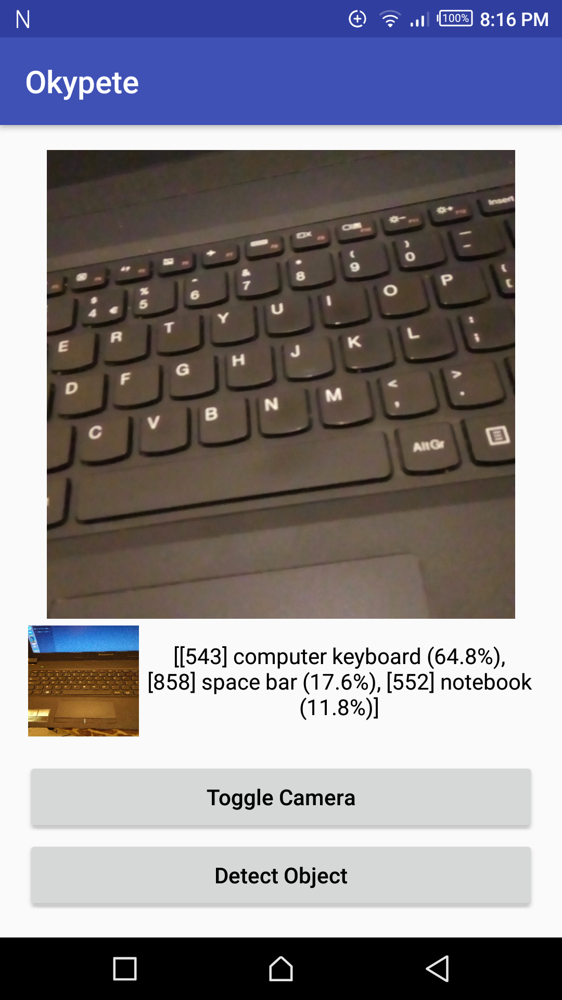
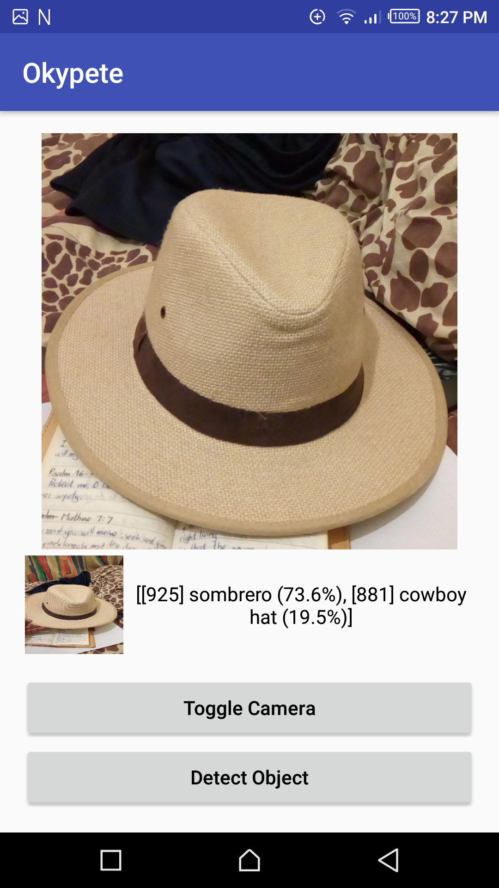
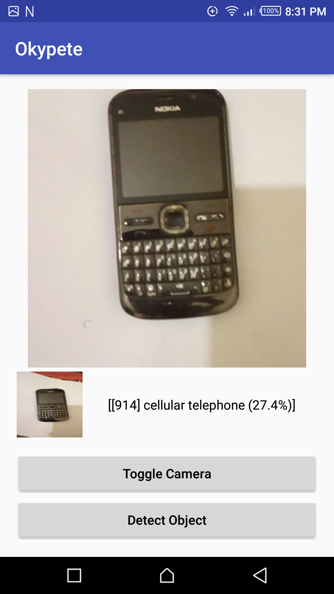

# Okypete, a simple Image Classifier using TensorFlow

##  About Android TensorFlow Machine Learning Example
* This is an example project for integrating [TensorFlow](https://github.com/tensorflow/tensorflow) into Android application
* How to build TensorFlow project to use with Android project.
* How to build TensorFlow library(.so file and jar file) to use with Android Application.
* This project include an example for object detection for an image taken from camera using TensorFlow library.

[Read this article. It describes everything about building TensorFlow for Android.](https://blog.mindorks.com/android-tensorflow-machine-learning-example-ff0e9b2654cc)

 
 

### Credits
* The classifier example has been taken from Google TensorFlow example.

### Contributing to Okypete
Just make pull request